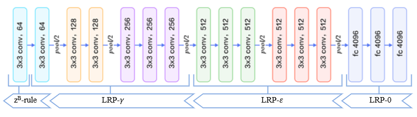

# LRP-model-investigation
This repository contains the program code from a study investigating the impact of Layer-Wise Relevance Propagation (LRP) model parameters, specifically focusing on the epsilon (ε) and gamma (γ) settings. This work forms an integral part of a Bachelor's thesis, which aims to elucidate classification results using LRP techniques.

## Research Objective
The goal of this research is to identify optimal epsilon and gamma parameters for a baseline LRP model to achieve the best accuracy in visualizing results from the VGG16 model for a brain cancer classification task. This study is structured in multiple phases, as initial trials achieved suboptimal results, prompting a search for potential errors and solutions that could enhance the accuracy of the LRP model. A thorough description will provide deeper insights into the practical application of LRP methods, highlighting their significance and effectiveness in addressing real-world problems in medical image analysis.

## LRP Model Structure
The study analyzed an LRP model structured with specific relevance propagation rules across different layers of a VGG16 architecture. The model utilizes:
- **Z-B Rule** for the earliest convolutional layers.
- **LRP-γ** for intermediate convolutional layers.
- **LRP-ε** for deeper convolutional layers and the first fully connected layers.
- **LRP-0** for the final fully connected layers.

## LRP Output Map Accuracy Calculation

The accuracy of the LRP model is assessed using the Intersection over Union (IoU) measure, which compares LRP-generated relevance maps with actual MRI segmentation masks. Instead of directly equating the relevance map to a segmentation mask, a relevance map mask is created by assigning a quantile threshold. This threshold converts the relevance values into a binary mask, allowing only the top percentage of values, such as the 90th percentile, to be included in the mask.

This binary mask is then compared to the segmentation mask to evaluate the model's effectiveness in identifying critical brain tumor areas. The IoU measure is particularly valuable as it provides a precise, normalized measurement of overlap and allows for an objective comparison across different models, incorporating both precision and recall to avoid biased assessments.

## Dataset
The study utilizes the [Figshare Brain Tumor Dataset](https://www.kaggle.com/datasets/ashkhagan/figshare-brain-tumor-dataset) available on Kaggle. This dataset includes a variety of brain MRI images used to analyze the effectiveness of LRP parameters in classifying different types of brain tumors.

## Model
The research focuses on the CNN model VGG16, a renowned model for deep learning image classification tasks. More details about VGG16 can be found on the [VGG16 model page](https://neurohive.io/en/popular-networks/vgg16/).

## Technologies
The following technologies and libraries were used in this project:
- **Python**: Main programming language.
- **PyTorch**: Used for building and training the neural network models.
- **Matplotlib**: For plotting graphs and visualizing the results.
- **Numpy**: For handling high-level mathematical functions and multi-dimensional arrays.
- **Jupyter Notebook**: Used for running code interactively and visualizing the data inline.
